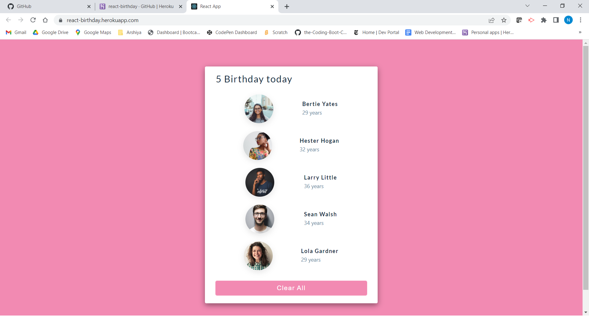

# About
Very fun and intersting application. It's simple 
and to the point , I got inspired by Freecode Camp
react tutorial while I was practicing the react coding
skills.

# TABLE OF CONTENTS
[ Description](#Description)

[INSTALLATION](#INSTALLATION)

[TEXT-EDITOR](#TEXT-EDITOR)

[PROGRAMMING-LANGUAGE](#PROGRAMMING-LANGUAGE)

[RESOURCES-REFERRED](#RESOURCES-REFERRED)

[SCREENSHOT](#SCREENSHOT)

[GIT_HUB-REPOSITORY](#GIT_HUB-REPOSITORY)

[Heroku-Deployed-Link](#GIT_HUB-Deployed-Link)

# Description
In this application, user is presented with very
vibrant and simple front end . It's basically about simple 
birthday information where user can see how many people 
have their birthday with their age and user can clear them as well.

# INSTALLATION

**npx create-react-app<appname>**

## TEXT-EDITOR
**Vs-code**

## PROGRAMMING-LANGUAGE

REACT

CSS

JAVASCRIPT

HTML 

# RESOURCES-REFERRED

[React-Documentation](https://reactjs.org/docs/hooks-state.html)

[Tutorial](https://www.youtube.com/watch?v=a_7Z7C_JCyo&t=4665s)

[w3schools-documentation](https://www.w3schools.com/REACT/react_css_styling.asp)

[Colors](https://coolors.co/palettes/trending)

# SCREENSHOT

# GIT_HUB-REPOSITORY
[GIT-HUB](https://github.com/nehreetkaur/react-birthday)

# Heroku-Deployed-Link
[Heroku](https://react-birthday.herokuapp.com/)